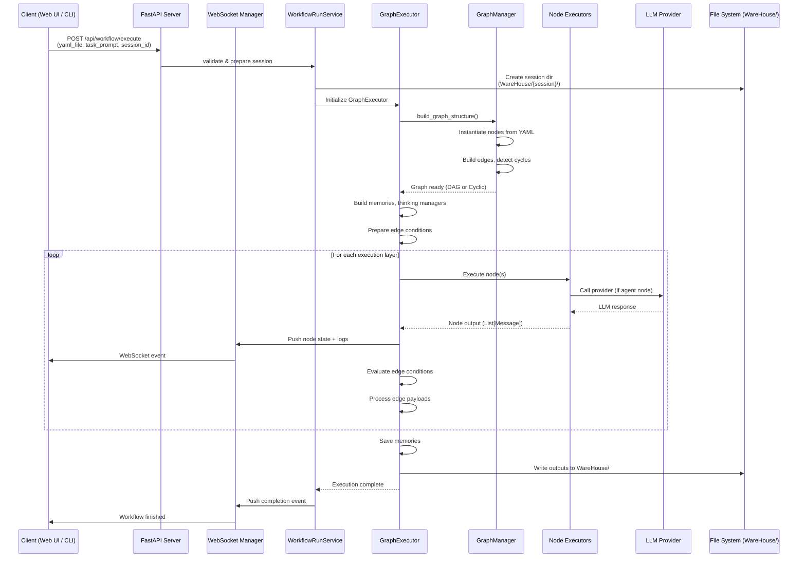
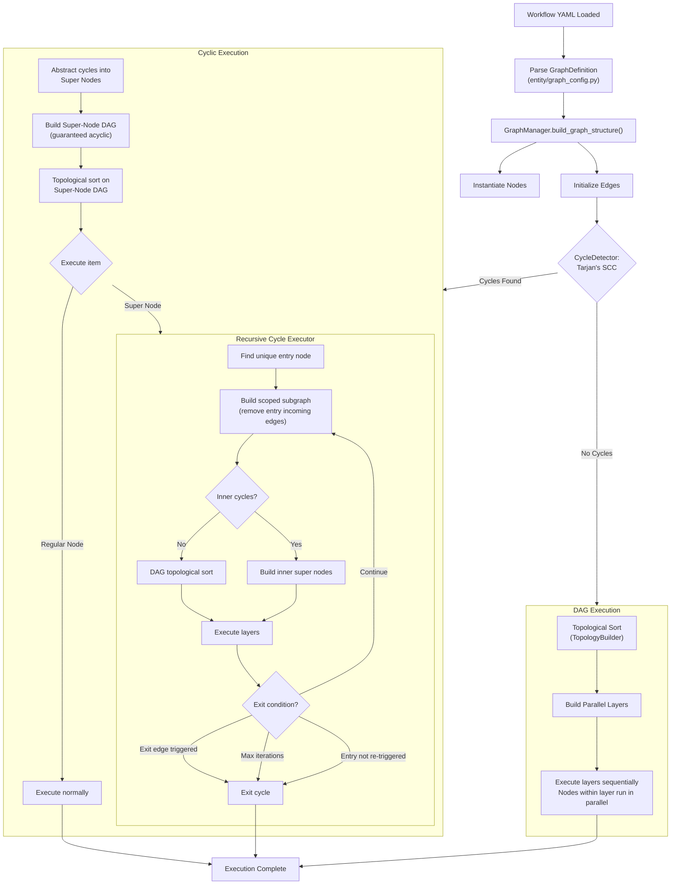
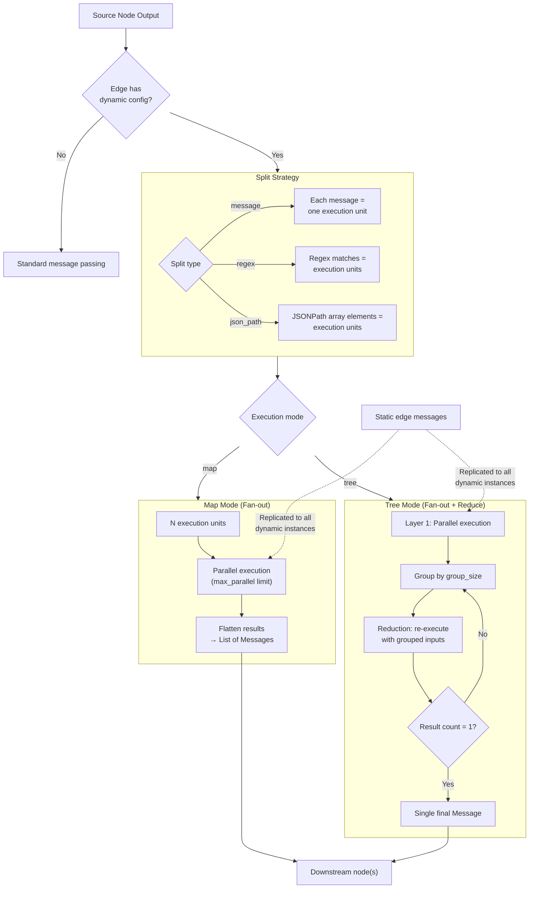
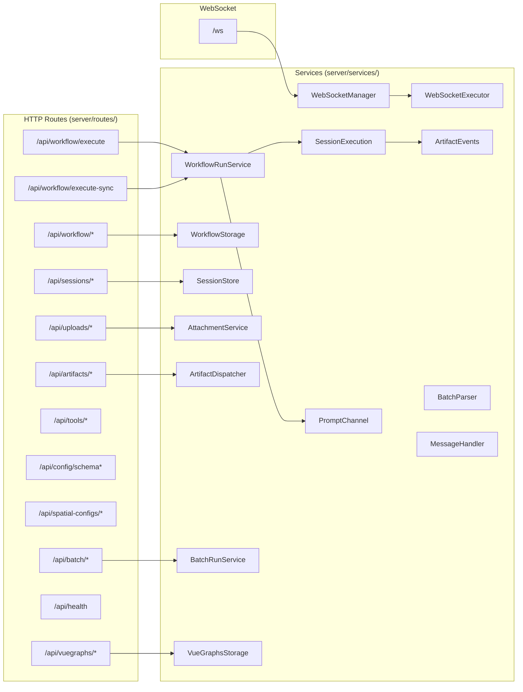

# DevAll System Architecture

This document provides a comprehensive visual architecture of the DevAll backend, using mermaid diagrams to illustrate how the major subsystems interact. For detailed feature documentation, see the [User Guide](user_guide/en/index.md).

---

## 1. High-Level System Architecture

```mermaid
graph TB
    subgraph Clients["Clients"]
        WebUI["Web UI (Vue.js)"]
        CLI["CLI (run.py)"]
        SDK["Python SDK (runtime/sdk.py)"]
    end

    subgraph Server["Server Layer (FastAPI)"]
        direction TB
        App["FastAPI App (server/app.py)"]
        Bootstrap["Bootstrap (server/bootstrap.py)"]
        MW["Middleware (CORS, Error Handling, Logging)"]

        subgraph Routes["HTTP/WS Routes"]
            WorkflowR["Workflow Routes"]
            ExecuteR["Execute Routes"]
            SessionR["Session Routes"]
            ArtifactR["Artifact Routes"]
            UploadR["Upload Routes"]
            WS["WebSocket Endpoint"]
            ConfigR["Config Schema Router"]
            SpatialR["Spatial Config Routes"]
        end

        subgraph Services["Services"]
            WRS["WorkflowRunService"]
            WSManager["WebSocketManager"]
            SessionStore["SessionStore"]
            BatchService["BatchRunService"]
            ArtifactSvc["ArtifactDispatcher"]
            PromptCh["PromptChannel"]
        end
    end

    subgraph Workflow["Workflow Engine (workflow/)"]
        GE["GraphExecutor"]
        GM["GraphManager"]
        TB2["TopologyBuilder"]
        CM["CycleManager / CycleDetector"]
        GCtx["GraphContext"]

        subgraph Executors["Execution Strategies"]
            DAG["DagExecutionStrategy"]
            CYC["CycleExecutionStrategy"]
            DYN["DynamicEdgeExecutor"]
            PAR["ParallelExecutor"]
            MV["MajorityVoteStrategy"]
        end
    end

    subgraph Runtime["Runtime Layer (runtime/)"]
        subgraph NodeExec["Node Executors (runtime/node/)"]
            AgentEx["AgentExecutor"]
            PythonEx["PythonExecutor"]
            HumanEx["HumanExecutor"]
            SubgraphEx["SubgraphExecutor"]
            PassEx["PassthroughExecutor"]
            LiteralEx["LiteralExecutor"]
            LoopCEx["LoopCounterExecutor"]
            LoopTEx["LoopTimerExecutor"]
        end

        subgraph AgentModules["Agent Modules (runtime/node/agent/)"]
            Providers["LLM Providers (OpenAI, Gemini)"]
            Memory["Memory (Simple, File, Blackboard, RLM)"]
            Thinking["Thinking (SelfReflection)"]
            Tooling["Tool Manager (Function, MCP)"]
        end

        subgraph EdgeLayer["Edge Layer (runtime/edge/)"]
            Conditions["Edge Conditions (Keyword, Function, Custom)"]
            Processors["Edge Processors (Regex, Function)"]
        end
    end

    subgraph Entity["Entity / Config Layer (entity/)"]
        GraphCfg["GraphConfig / GraphDefinition"]
        NodeCfg["Node Configs"]
        EdgeCfg["Edge Configs"]
        Messages["Message Objects"]
        Enums["Enums / EnumOptions"]
    end

    subgraph Utils["Utilities (utils/)"]
        Logger["Logger / StructuredLogger"]
        LogMgr["LogManager"]
        AttachStore["AttachmentStore"]
        FnCatalog["FunctionCatalog"]
        FnMgr["FunctionManager"]
        TokenTrack["TokenTracker"]
        SchemaExp["SchemaExporter"]
        ErrHandler["ErrorHandler"]
    end

    subgraph Storage["Storage / Output"]
        WareHouse["WareHouse/ (Session Outputs)"]
        Logs["logs/ (Structured Logs)"]
        YAMLDir["yaml_instance/ (Workflows)"]
        SchemaReg["schema_registry/"]
    end

    WebUI -->|"HTTP/WS"| App
    CLI -->|"Direct"| GE
    SDK -->|"Direct"| GE

    App --> Bootstrap
    Bootstrap --> MW
    Bootstrap --> Routes
    Routes --> Services

    WRS --> GE
    WSManager --> WS
    SessionStore --> SessionR

    GE --> GM
    GM --> TB2
    GM --> CM
    GE --> GCtx
    GE --> Executors

    DAG --> NodeExec
    CYC --> NodeExec
    DYN --> NodeExec
    PAR --> NodeExec

    AgentEx --> AgentModules
    AgentEx --> Providers

    GE --> EdgeLayer
    GE --> Entity

    GE --> Utils
    GCtx --> WareHouse
    LogMgr --> Logs
    Entity --> YAMLDir
```

---

## 2. Request Lifecycle Flow

---

## 3. Workflow Execution Engine — DAG vs Cyclic

The execution engine automatically detects graph structure using Tarjan's strongly connected components algorithm and selects the appropriate strategy. See [Graph Execution Logic](user_guide/en/execution_logic.md) for full details.

---

## 4. Agent Node Execution Pipeline

Agent nodes are the primary compute unit, orchestrating LLM calls with optional thinking, memory, and tooling phases. See [Workflow Authoring § Agent Features](user_guide/en/workflow_authoring.md#6-agent-node-advanced-features) for configuration details.

```mermaid
flowchart LR
    Input["Input Messages<br/>(from predecessors)"] --> AgentEx["AgentExecutor"]

    AgentEx --> TemplatePhase["Apply prompt_template<br/>(Jinja2 rendering)"]

    TemplatePhase --> ThinkPhase{"Thinking<br/>enabled?"}
    ThinkPhase -->|"Yes"| Think["ThinkingManager<br/>(chain-of-thought /<br/>self-reflection)"]
    ThinkPhase -->|"No"| MemRead

    Think --> MemRead{"Memory<br/>configured?"}
    MemRead -->|"Yes"| ReadMem["MemoryManager.read()<br/>(simple / file / blackboard / RLM)"]
    MemRead -->|"No"| ToolCheck

    ReadMem --> ToolCheck{"Tooling<br/>configured?"}
    ToolCheck -->|"Yes"| ToolSetup["ToolManager<br/>(function / MCP)"]
    ToolCheck -->|"No"| LLMCall

    ToolSetup --> LLMCall["LLM Provider Call"]

    subgraph ProviderLayer["Provider Abstraction"]
        LLMCall --> ProviderSelect{"Provider type"}
        ProviderSelect -->|"openai"| OpenAI["OpenAI Provider"]
        ProviderSelect -->|"gemini"| Gemini["Gemini Provider"]
    end

    OpenAI --> Response["Provider Response"]
    Gemini --> Response

    Response --> ToolLoop{"Tool calls<br/>in response?"}
    ToolLoop -->|"Yes"| ExecTool["Execute tool function"]
    ExecTool --> LLMCall
    ToolLoop -->|"No"| PostProcess

    PostProcess --> WriteMem["MemoryManager.write()<br/>(persist to store)"]
    WriteMem --> Output["Output: List[Message]"]
```

---

## 5. Dynamic Execution — Map and Tree Modes

Dynamic execution enables parallel processing defined at the edge level. See [Dynamic Execution Guide](user_guide/en/dynamic_execution.md) for configuration and examples.

---

## 6. Server Layer — Routes and Services

---

## 7. Component Interaction Summary

| Layer | Key Modules | Responsibility |
|-------|------------|----------------|
| **Server** | `server/app.py`, `server/bootstrap.py`, `server/routes/`, `server/services/` | HTTP/WebSocket API, session management, real-time observability |
| **Workflow Engine** | `workflow/graph.py`, `workflow/graph_manager.py`, `workflow/cycle_manager.py`, `workflow/topology_builder.py`, `workflow/executor/` | Graph parsing, DAG/cyclic scheduling, dynamic map/tree execution |
| **Runtime** | `runtime/node/`, `runtime/edge/`, `runtime/sdk.py` | Node execution (agent, python, human, etc.), edge conditions/processors, provider abstraction |
| **Entity** | `entity/graph_config.py`, `entity/configs/`, `entity/messages.py`, `entity/enums.py` | Configuration dataclasses, message schema, enums |
| **Utilities** | `utils/logger.py`, `utils/attachments.py`, `utils/function_catalog.py`, `utils/token_tracker.py` | Structured logging, attachment management, function registry, token tracking |
| **Storage** | `WareHouse/`, `logs/`, `yaml_instance/`, `schema_registry/` | Session outputs, structured logs, workflow definitions, schema cache |

---

## Related Documentation

- [User Guide Index](user_guide/en/index.md) — Navigation map for all backend documentation
- [Graph Execution Logic](user_guide/en/execution_logic.md) — DAG and cyclic execution deep dive
- [Workflow Authoring](user_guide/en/workflow_authoring.md) — YAML structure, node types, edge conditions
- [Dynamic Execution](user_guide/en/dynamic_execution.md) — Map/tree parallel processing details
- [WebSocket Lifecycle](user_guide/en/ws_frontend_logic.md) — Frontend connection state machine
