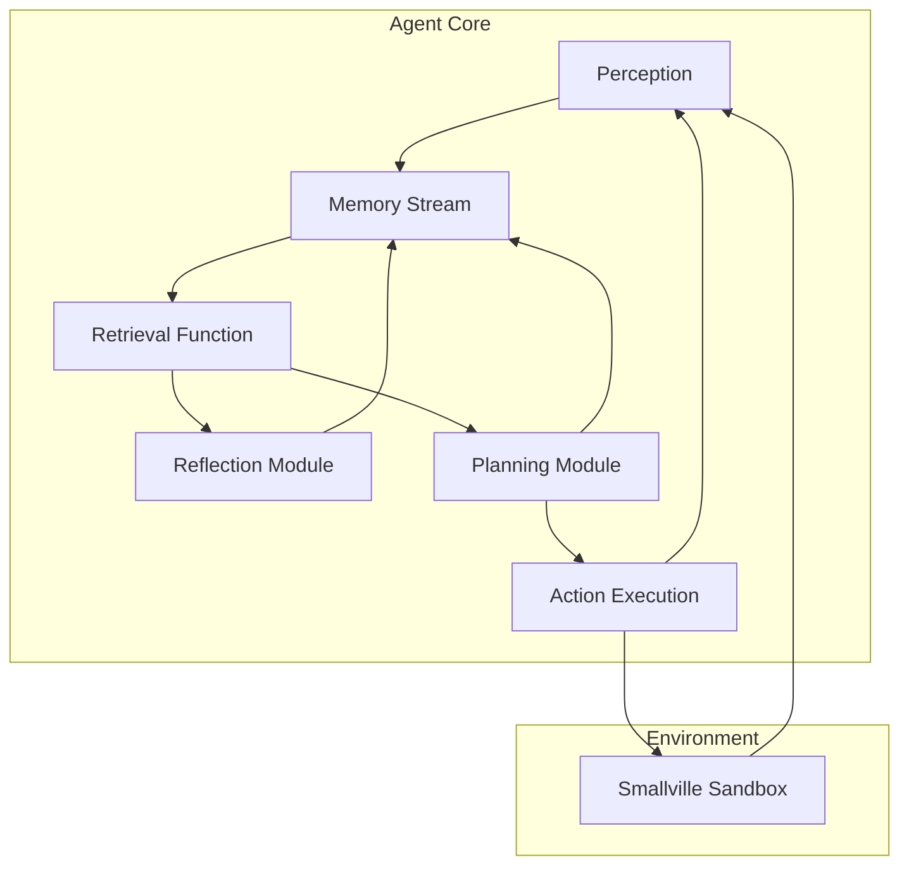
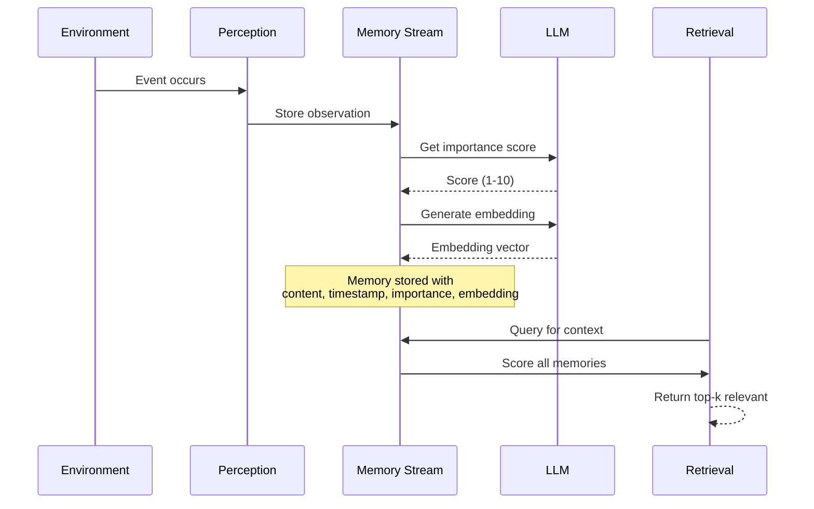
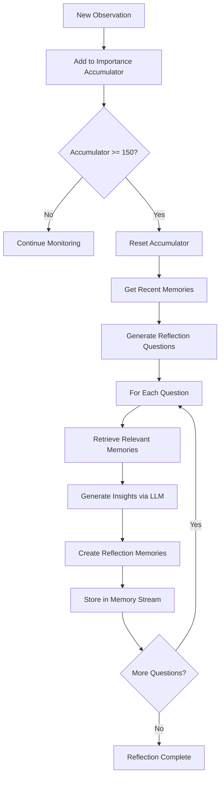
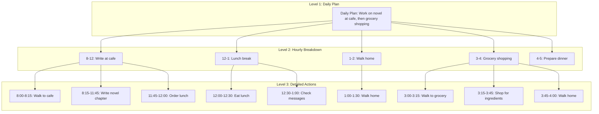
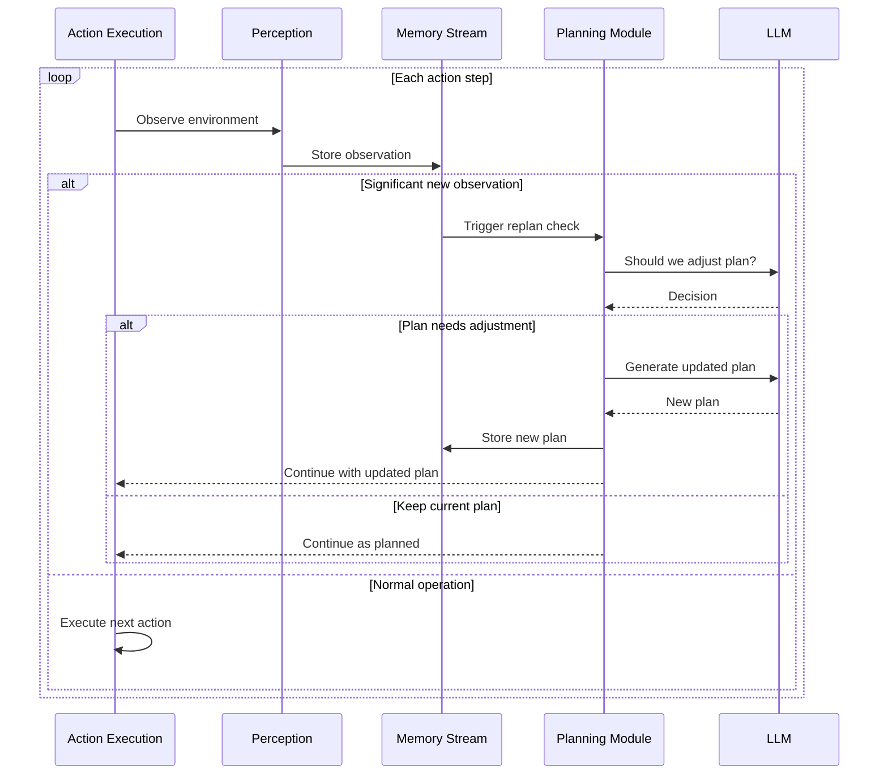
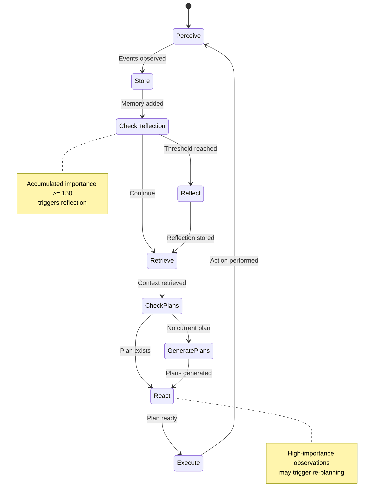
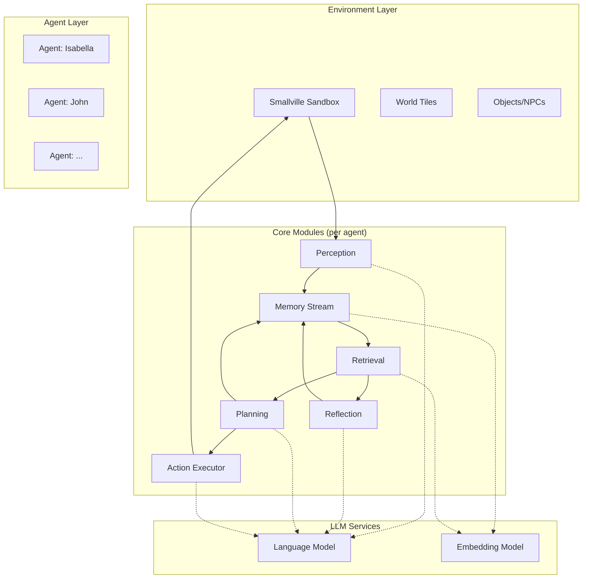
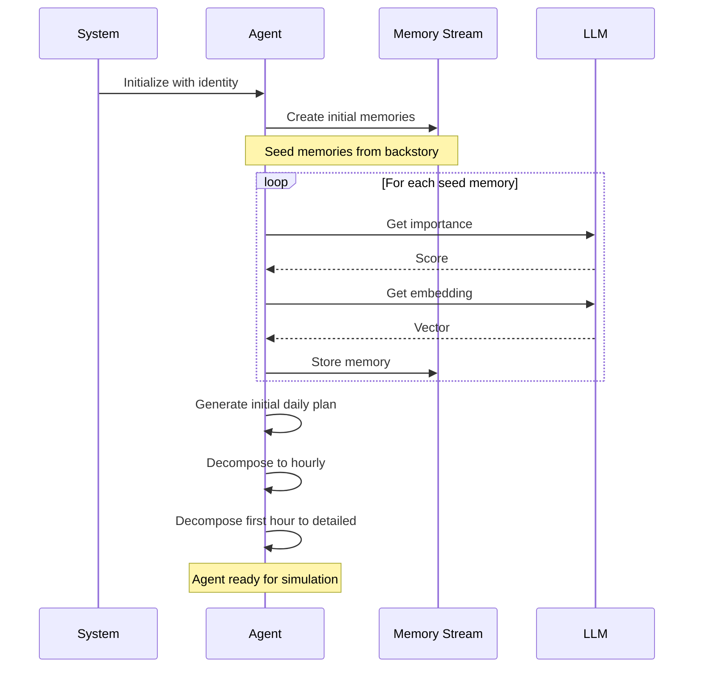

# Stanford Generative Agents: Architecture Documentation

**Paper:** Generative Agents: Interactive Simulacra of Human Behavior  
**Authors:** Park, O'Brien, Cai, Morris, Liang, Bernstein  
**arXiv:** 2304.03442  

This document provides detailed technical documentation of the agent architecture for developers implementing similar systems.

---

## Table of Contents

1. [System Overview](#system-overview)
2. [Memory Stream](#memory-stream)
3. [Reflection Module](#reflection-module)
4. [Planning System](#planning-system)
5. [Observation and Action Execution](#observation-and-action-execution)
6. [Complete Integration Flow](#complete-integration-flow)

---

## System Overview

### High-Level Architecture

```
+------------------+     +------------------+     +------------------+
|    Environment   | --> |   Perception     | --> |  Memory Stream   |
|    (Smallville)  |     |   Module         |     |  (Long-term)     |
+------------------+     +------------------+     +------------------+
                                  |                       |
                                  v                       v
                         +------------------+     +------------------+
                         |   Observation    |     |   Retrieval      |
                         |   Queue          |     |   Function       |
                         +------------------+     +------------------+
                                  |                       |
                                  |                       v
                                  |              +------------------+
                                  |              |   Reflection     |
                                  |              |   Module         |
                                  |              +------------------+
                                  |                       |
                                  v                       v
                         +------------------+     +------------------+
                         |   Action         | <-- |   Planning       |
                         |   Execution      |     |   Module         |
                         +------------------+     +------------------+
                                  |
                                  v
                         +------------------+
                         |   Environment    |
                         |   (Actions)      |
                         +------------------+
```

### Component Interaction Flow



### Key Design Principles

1. **Memory-First**: All experiences stored as natural language
2. **Synthesis-Based**: Raw observations elevated to higher-level insights
3. **Hierarchical Planning**: Abstract goals decomposed to concrete actions
4. **Dynamic Retrieval**: Context-aware memory access
5. **Feedback Loops**: All outputs feed back into memory

---

## Memory Stream

### Data Structure

The memory stream is a chronological database of all agent experiences, stored as natural language records.

```
MemoryStream
├── memories: List[Memory]
├── embeddings: Dict[MemoryId, Vector]
└── index: VectorIndex

Memory
├── id: UUID
├── content: str              # Natural language description
├── timestamp: datetime       # When event occurred
├── importance: float         # 1-10 scale, LLM-assigned
├── last_accessed: datetime   # For recency decay
├── type: Enum                # OBSERVATION | REFLECTION | PLAN
└── metadata: Dict            # Additional context
```

### Memory Entry Schema

```python
from dataclasses import dataclass
from datetime import datetime
from enum import Enum
from typing import Any, Dict, Optional
import uuid

class MemoryType(Enum):
    OBSERVATION = "observation"
    REFLECTION = "reflection"
    PLAN = "plan"

@dataclass
class Memory:
    id: uuid.UUID
    content: str
    timestamp: datetime
    importance: float
    last_accessed: datetime
    memory_type: MemoryType
    embedding: Optional[list[float]] = None
    metadata: Dict[str, Any] = None
    
    def __post_init__(self):
        if self.metadata is None:
            self.metadata = {}
```

### Retrieval Algorithm

The retrieval function scores memories using three weighted factors and returns the top-k most relevant.

#### Scoring Components

| Component | Description | Calculation |
|-----------|-------------|-------------|
| **Recency** | Time decay favoring recent memories | `0.995 ^ hours_since_access` |
| **Importance** | Significance of the memory | LLM-rated 1-10 scale |
| **Relevance** | Semantic similarity to query | Cosine similarity of embeddings |

#### Combined Scoring Formula

```
score(mem) = w_r * recency(mem) + w_i * importance(mem) + w_v * relevance(mem, query)

where:
    w_r = recency weight (default: 1.0)
    w_i = importance weight (default: 1.0)
    w_v = relevance weight (default: 1.0)
```

#### Retrieval Pseudocode

```python
def retrieve_memories(
    query: str,
    memory_stream: list[Memory],
    top_k: int = 10,
    recency_weight: float = 1.0,
    importance_weight: float = 1.0,
    relevance_weight: float = 1.0,
    decay_factor: float = 0.995
) -> list[Memory]:
    """
    Retrieve the most relevant memories based on recency, importance, and relevance.
    
    Args:
        query: The search query (current situation/context)
        memory_stream: All memories in the agent's memory
        top_k: Number of memories to retrieve
        recency_weight: Weight for recency score
        importance_weight: Weight for importance score
        relevance_weight: Weight for relevance score
        decay_factor: Exponential decay factor for recency
    
    Returns:
        Top-k most relevant memories, sorted by combined score
    """
    query_embedding = get_embedding(query)
    current_time = datetime.now()
    
    scored_memories = []
    
    for memory in memory_stream:
        # 1. Calculate recency score (exponential decay)
        hours_since_access = (current_time - memory.last_accessed).total_seconds() / 3600
        recency_score = decay_factor ** hours_since_access
        
        # 2. Get importance score (normalized to 0-1)
        importance_score = memory.importance / 10.0
        
        # 3. Calculate relevance score (cosine similarity)
        relevance_score = cosine_similarity(query_embedding, memory.embedding)
        
        # 4. Compute weighted combined score
        combined_score = (
            recency_weight * recency_score +
            importance_weight * importance_score +
            relevance_weight * relevance_score
        )
        
        scored_memories.append((memory, combined_score))
    
    # 5. Sort by score and return top-k
    scored_memories.sort(key=lambda x: x[1], reverse=True)
    return [memory for memory, score in scored_memories[:top_k]]


def cosine_similarity(vec_a: list[float], vec_b: list[float]) -> float:
    """Calculate cosine similarity between two vectors."""
    dot_product = sum(a * b for a, b in zip(vec_a, vec_b))
    magnitude_a = sum(a ** 2 for a in vec_a) ** 0.5
    magnitude_b = sum(b ** 2 for b in vec_b) ** 0.5
    
    if magnitude_a == 0 or magnitude_b == 0:
        return 0.0
    
    return dot_product / (magnitude_a * magnitude_b)
```

#### Memory Importance Assignment

```python
def calculate_importance(content: str, llm_client) -> float:
    """
    Use LLM to rate the importance of a memory on a scale of 1-10.
    
    Higher scores indicate more significant/impactful events.
    """
    prompt = f"""
    On a scale of 1 to 10, rate how important or significant the following 
    event is to a person's life, where 1 is mundane (eating breakfast) 
    and 10 is life-changing (getting married, winning an award).
    
    Event: {content}
    
    Return only a single number between 1 and 10.
    """
    
    response = llm_client.generate(prompt)
    return float(response.strip())
```

### Memory Stream Operations Flow



---

## Reflection Module

### Purpose

Reflection enables agents to synthesize accumulated observations into higher-level insights, analogous to human introspection. This creates "System 2" deliberative thinking that informs future behavior.

### Trigger Mechanism

Reflection is NOT triggered by time, but by accumulated importance of recent events.

```
Trigger Condition: SUM(importance of recent events) >= THRESHOLD
Default Threshold: 150
Expected Frequency: 2-3 times per simulated day
```

### Reflection Process Flow

```
1. CHECK TRIGGER
   └── Sum recent importance scores
   └── If >= threshold, initiate reflection

2. GENERATE QUESTIONS
   └── Query LLM with recent memories
   └── Extract 3-5 high-level questions about experiences

3. RETRIEVE CONTEXT
   └── For each question, retrieve relevant memories
   └── Use standard retrieval function

4. SYNTHESIZE INSIGHTS
   └── LLM generates 5 high-level insights per question
   └── Insights must be inferential, not restatements

5. STORE REFLECTIONS
   └── Add reflections to memory stream
   └── Assign importance scores
   └── Generate embeddings
```

### Reflection Pseudocode

```python
from dataclasses import dataclass
from typing import List

@dataclass
class ReflectionConfig:
    threshold: float = 150.0
    questions_count: int = 3
    insights_per_question: int = 5
    recent_memory_window: int = 100  # Last N memories to consider


class ReflectionModule:
    def __init__(self, config: ReflectionConfig, llm_client, embedding_client):
        self.config = config
        self.llm = llm_client
        self.embedding = embedding_client
        self.importance_accumulator = 0.0
    
    def process_observation(self, memory: Memory, memory_stream: List[Memory]):
        """
        Process a new observation and check if reflection should be triggered.
        """
        # Add importance to accumulator
        self.importance_accumulator += memory.importance
        
        # Check trigger condition
        if self.importance_accumulator >= self.config.threshold:
            self.trigger_reflection(memory_stream)
            self.importance_accumulator = 0.0
    
    def trigger_reflection(self, memory_stream: List[Memory]) -> List[Memory]:
        """
        Execute the full reflection process.
        
        Returns:
            List of newly created reflection memories
        """
        # Step 1: Get recent memories for context
        recent_memories = memory_stream[-self.config.recent_memory_window:]
        recent_content = "\n".join([
            f"[{m.timestamp}] {m.content}" 
            for m in recent_memories
        ])
        
        # Step 2: Generate reflection questions
        questions = self._generate_questions(recent_content)
        
        # Step 3 & 4: Generate insights for each question
        all_reflections = []
        for question in questions:
            # Retrieve relevant memories for this question
            relevant = retrieve_memories(
                query=question,
                memory_stream=memory_stream,
                top_k=20
            )
            
            # Generate insights
            insights = self._generate_insights(question, relevant)
            
            # Create reflection memories
            for insight in insights:
                reflection = Memory(
                    id=uuid.uuid4(),
                    content=insight,
                    timestamp=datetime.now(),
                    importance=self._calculate_reflection_importance(insight),
                    last_accessed=datetime.now(),
                    memory_type=MemoryType.REFLECTION,
                    metadata={"source_question": question}
                )
                reflection.embedding = self.embedding.embed(insight)
                all_reflections.append(reflection)
        
        # Step 5: Store all reflections
        memory_stream.extend(all_reflections)
        
        return all_reflections
    
    def _generate_questions(self, recent_content: str) -> List[str]:
        """Generate high-level questions about recent experiences."""
        prompt = f"""
        Based on the following recent experiences and observations,
        generate {self.config.questions_count} high-level questions 
        that would help someone reflect on patterns, relationships, 
        or themes in these events.
        
        Recent experiences:
        {recent_content}
        
        Return only the questions, one per line, numbered.
        """
        
        response = self.llm.generate(prompt)
        questions = [
            line.split(". ", 1)[1] 
            for line in response.strip().split("\n") 
            if ". " in line
        ]
        
        return questions[:self.config.questions_count]
    
    def _generate_insights(
        self, 
        question: str, 
        relevant_memories: List[Memory]
    ) -> List[str]:
        """Generate insights based on question and relevant memories."""
        context = "\n".join([m.content for m in relevant_memories])
        
        prompt = f"""
        Question: {question}
        
        Relevant context:
        {context}
        
        Based on the above context, generate {self.config.insights_per_question}
        high-level insights or inferences. These should be abstract 
        conclusions that go beyond simply restating facts.
        
        Return only the insights, one per line, numbered.
        """
        
        response = self.llm.generate(prompt)
        insights = [
            line.split(". ", 1)[1]
            for line in response.strip().split("\n")
            if ". " in line
        ]
        
        return insights[:self.config.insights_per_question]
    
    def _calculate_reflection_importance(self, insight: str) -> float:
        """Calculate importance score for a reflection."""
        # Reflections typically have higher importance than observations
        # Use LLM to rate, with minimum threshold
        base_importance = calculate_importance(insight, self.llm)
        return max(base_importance, 5.0)  # Minimum 5 for reflections
```

### Reflection Flow Diagram



### Example Reflection Sequence

```
INPUT OBSERVATIONS:
- [8:00] John mentioned he's working on a watercolor painting
- [10:30] John asked about local art supply stores
- [14:00] John has been spending time in the studio
- [16:00] John showed enthusiasm about a new brush technique

ACCUMULATED IMPORTANCE: 3 + 4 + 3 + 5 = 15 (continues accumulating...)

WHEN THRESHOLD REACHED (150):
GENERATED QUESTIONS:
1. What creative interests has John been pursuing lately?
2. How does John approach developing new skills?
3. What can be inferred about John's artistic goals?

GENERATED INSIGHTS:
- John is passionate about art and actively developing his painting skills
- John takes a structured approach to learning, researching supplies and techniques
- John appears to be in an active creative phase, investing significant time in art
```

---

## Planning System

### Purpose

The planning system creates future action sequences that maintain behavioral consistency over time. Plans are hierarchical, decomposing from abstract daily goals to concrete moment-by-moment actions.

### Planning Hierarchy

```
Level 1: DAILY PLAN (generated once per day)
├── High-level activities and goals
├── Based on: identity, reflections, previous day
└── Format: "Work on novel at cafe, then grocery shopping"

Level 2: HOURLY BREAKDOWN (generated per day)
├── Decompose daily plan into hour blocks
├── Each hour has a primary activity
└── Format: "8am-12pm: Write at cafe | 1pm-2pm: Lunch"

Level 3: DETAILED ACTIONS (generated per hour)
├── Decompose each hour into 5-15 minute actions
├── Include specific movements and interactions
└── Format: "8:00-8:15: Walk to cafe | 8:15-11:45: Write"
```

### Plan Data Structure

```python
from dataclasses import dataclass
from datetime import datetime, timedelta
from typing import List, Optional
from enum import Enum

class PlanLevel(Enum):
    DAILY = "daily"
    HOURLY = "hourly"
    DETAILED = "detailed"

@dataclass
class Plan:
    id: uuid.UUID
    level: PlanLevel
    content: str
    start_time: datetime
    end_time: datetime
    parent_id: Optional[uuid.UUID] = None  # Link to parent plan
    children: List['Plan'] = None
    
    def __post_init__(self):
        if self.children is None:
            self.children = []
```

### Planning Process Pseudocode

```python
class PlanningModule:
    def __init__(self, llm_client, embedding_client):
        self.llm = llm_client
        self.embedding = embedding_client
    
    def generate_daily_plan(
        self,
        agent_identity: dict,
        memory_stream: List[Memory],
        current_date: datetime
    ) -> Plan:
        """
        Generate a high-level plan for the day.
        
        Args:
            agent_identity: Agent's name, traits, background
            memory_stream: Agent's memory for context
            current_date: The date to plan for
        
        Returns:
            A daily-level Plan
        """
        # Retrieve relevant context
        context_memories = retrieve_memories(
            query=f"plans and activities for {current_date.strftime('%A')}",
            memory_stream=memory_stream,
            top_k=50
        )
        
        # Get recent reflections
        reflections = [
            m for m in memory_stream
            if m.memory_type == MemoryType.REFLECTION
        ][-10:]
        
        # Build prompt
        prompt = self._build_daily_plan_prompt(
            agent_identity,
            context_memories,
            reflections,
            current_date
        )
        
        # Generate plan
        plan_content = self.llm.generate(prompt)
        
        return Plan(
            id=uuid.uuid4(),
            level=PlanLevel.DAILY,
            content=plan_content,
            start_time=current_date.replace(hour=8, minute=0),
            end_time=current_date.replace(hour=22, minute=0)
        )
    
    def decompose_to_hourly(
        self,
        daily_plan: Plan,
        agent_identity: dict
    ) -> List[Plan]:
        """
        Decompose a daily plan into hourly segments.
        
        Args:
            daily_plan: The high-level daily plan
            agent_identity: Agent's identity for context
        
        Returns:
            List of hourly Plans
        """
        prompt = f"""
        {agent_identity['name']}'s daily plan: {daily_plan.content}
        
        Decompose this into an hourly schedule from 8 AM to 10 PM.
        For each hour, specify the primary activity.
        
        Format:
        [8:00 - 9:00]: Activity
        [9:00 - 10:00]: Activity
        ...
        """
        
        response = self.llm.generate(prompt)
        hourly_plans = self._parse_hourly_response(response, daily_plan)
        
        return hourly_plans
    
    def decompose_to_detailed(
        self,
        hourly_plan: Plan,
        memory_stream: List[Memory]
    ) -> List[Plan]:
        """
        Decompose an hourly plan into detailed 5-15 minute actions.
        
        Args:
            hourly_plan: The hourly plan to decompose
            memory_stream: For context-aware planning
        
        Returns:
            List of detailed action Plans
        """
        # Get relevant context for this hour
        context = retrieve_memories(
            query=hourly_plan.content,
            memory_stream=memory_stream,
            top_k=10
        )
        
        prompt = f"""
        Hour activity: {hourly_plan.content}
        Time: {hourly_plan.start_time.strftime('%H:%M')} - {hourly_plan.end_time.strftime('%H:%M')}
        
        Create a detailed minute-by-minute plan with actions every 5-15 minutes.
        Include specific movements, locations, and interactions.
        
        Format:
        [HH:MM - HH:MM]: Specific action
        ...
        """
        
        response = self.llm.generate(prompt)
        detailed_plans = self._parse_detailed_response(response, hourly_plan)
        
        # Store plans in memory
        for plan in detailed_plans:
            memory = Memory(
                id=uuid.uuid4(),
                content=f"Plan: {plan.content}",
                timestamp=datetime.now(),
                importance=5.0,  # Plans have moderate importance
                last_accessed=datetime.now(),
                memory_type=MemoryType.PLAN,
                metadata={"plan_level": "detailed"}
            )
            memory_stream.append(memory)
        
        return detailed_plans
    
    def _build_daily_plan_prompt(
        self,
        identity: dict,
        memories: List[Memory],
        reflections: List[Memory],
        date: datetime
    ) -> str:
        """Build the prompt for daily plan generation."""
        memory_context = "\n".join([m.content for m in memories[-20:]])
        reflection_context = "\n".join([r.content for r in reflections[-5:]])
        
        return f"""
        Name: {identity['name']}
        Traits: {', '.join(identity.get('traits', []))}
        Background: {identity.get('background', 'Not specified')}
        
        Recent experiences:
        {memory_context}
        
        Recent reflections:
        {reflection_context}
        
        Today is {date.strftime('%A, %B %d')}.
        
        Based on the above, create a brief daily plan for {identity['name']}.
        The plan should reflect their personality, recent experiences,
        and any ongoing goals or commitments.
        
        Keep the plan to 2-3 sentences describing the day's main activities.
        """
    
    def replan(
        self,
        current_plan: Plan,
        new_observation: Memory,
        memory_stream: List[Memory]
    ) -> Plan:
        """
        Dynamically adjust plans based on new observations.
        
        Args:
            current_plan: The plan being disrupted
            new_observation: The triggering observation
            memory_stream: Full memory context
        
        Returns:
            Updated plan
        """
        prompt = f"""
        Current plan: {current_plan.content}
        New observation: {new_observation.content}
        
        Should the plan be adjusted? If yes, provide an updated plan.
        If no, respond with "KEEP CURRENT PLAN".
        
        Consider:
        - Is this observation significant enough to warrant change?
        - Can the current plan accommodate this new information?
        - What would be a natural human response?
        """
        
        response = self.llm.generate(prompt)
        
        if "KEEP CURRENT PLAN" in response:
            return current_plan
        
        return Plan(
            id=uuid.uuid4(),
            level=current_plan.level,
            content=response,
            start_time=current_plan.start_time,
            end_time=current_plan.end_time,
            parent_id=current_plan.parent_id
        )
```

### Planning Hierarchy Diagram



### Dynamic Re-planning Flow



---

## Observation and Action Execution

### Perception Module

The perception module converts environmental events into memory entries.

```python
class PerceptionModule:
    def __init__(self, agent_identity: dict):
        self.agent = agent_identity
    
    def perceive(
        self,
        environment_state: dict,
        nearby_events: list[dict]
    ) -> list[Memory]:
        """
        Process environmental events into memory entries.
        
        Args:
            environment_state: Current state of the world
            nearby_events: Events within perception radius
        
        Returns:
            List of Memory objects for perceived events
        """
        observations = []
        
        for event in nearby_events:
            # Convert event to natural language
            description = self._describe_event(event, environment_state)
            
            # Create memory
            memory = Memory(
                id=uuid.uuid4(),
                content=description,
                timestamp=datetime.now(),
                importance=0.0,  # Will be calculated
                last_accessed=datetime.now(),
                memory_type=MemoryType.OBSERVATION,
                metadata={
                    "event_type": event.get("type"),
                    "location": event.get("location"),
                    "subjects": event.get("subjects", [])
                }
            )
            
            observations.append(memory)
        
        return observations
    
    def _describe_event(self, event: dict, env_state: dict) -> str:
        """Convert structured event to natural language description."""
        event_type = event.get("type", "unknown")
        subject = event.get("subject", "someone")
        action = event.get("action", "did something")
        location = event.get("location", "somewhere")
        
        return f"{subject} {action} at {location}"
```

### Action Execution Module

```python
from enum import Enum
from dataclasses import dataclass

class ActionType(Enum):
    MOVE = "move"
    INTERACT = "interact"
    SPEAK = "speak"
    IDLE = "idle"

@dataclass
class Action:
    type: ActionType
    target: Optional[str] = None
    content: Optional[str] = None
    duration_minutes: int = 5
    location: Optional[str] = None


class ActionExecutor:
    def __init__(self, environment, llm_client):
        self.environment = environment
        self.llm = llm_client
    
    def execute(self, plan: Plan, current_state: dict) -> Action:
        """
        Execute the current plan step.
        
        Args:
            plan: Current detailed plan being executed
            current_state: Agent's current state (location, status, etc.)
        
        Returns:
            Action to perform
        """
        # Parse plan content into action
        action = self._parse_plan_to_action(plan.content, current_state)
        
        # Execute in environment
        result = self.environment.perform_action(
            agent_id=current_state["agent_id"],
            action=action
        )
        
        return action
    
    def _parse_plan_to_action(
        self,
        plan_content: str,
        current_state: dict
    ) -> Action:
        """Parse natural language plan into structured action."""
        # Use LLM to extract action details
        prompt = f"""
        Current location: {current_state.get('location', 'unknown')}
        Plan action: {plan_content}
        
        Extract the specific action being performed. Return in format:
        TYPE: [move|interact|speak|idle]
        TARGET: [location or agent name, if applicable]
        CONTENT: [dialogue or description, if applicable]
        DURATION: [minutes]
        """
        
        response = self.llm.generate(prompt)
        return self._parse_action_response(response)
    
    def _parse_action_response(self, response: str) -> Action:
        """Parse LLM response into Action object."""
        lines = response.strip().split("\n")
        data = {}
        
        for line in lines:
            if ": " in line:
                key, value = line.split(": ", 1)
                data[key.lower()] = value
        
        return Action(
            type=ActionType(data.get("type", "idle")),
            target=data.get("target"),
            content=data.get("content"),
            duration_minutes=int(data.get("duration", 5)),
            location=data.get("target") if data.get("type") == "move" else None
        )
```

### Complete Agent Loop

```python
class GenerativeAgent:
    def __init__(
        self,
        identity: dict,
        llm_client,
        embedding_client,
        environment
    ):
        self.identity = identity
        self.memory_stream: List[Memory] = []
        self.current_plans: List[Plan] = []
        
        self.perception = PerceptionModule(identity)
        self.reflection = ReflectionModule(
            ReflectionConfig(), llm_client, embedding_client
        )
        self.planning = PlanningModule(llm_client, embedding_client)
        self.executor = ActionExecutor(environment, llm_client)
        
        self.llm = llm_client
        self.embedding = embedding_client
    
    def step(self, environment_state: dict, nearby_events: list[dict]):
        """
        Execute one step of the agent loop.
        
        This is called by the environment at each tick (typically every
        few seconds of simulated time).
        """
        # 1. PERCEIVE: Process environmental events
        observations = self.perception.perceive(
            environment_state, nearby_events
        )
        
        # 2. STORE: Add observations to memory stream
        for obs in observations:
            obs.importance = calculate_importance(obs.content, self.llm)
            obs.embedding = self.embedding.embed(obs.content)
            self.memory_stream.append(obs)
            
            # Check for reflection trigger
            self.reflection.process_observation(obs, self.memory_stream)
        
        # 3. RETRIEVE: Get relevant context
        context = retrieve_memories(
            query=self._build_context_query(),
            memory_stream=self.memory_stream,
            top_k=20
        )
        
        # 4. CHECK PLANS: Do we have plans for current time?
        current_time = environment_state["current_time"]
        current_plan = self._get_current_plan(current_time)
        
        if current_plan is None:
            # Generate new plans
            current_plan = self._generate_plans(current_time)
        
        # 5. REACT: Check if re-planning needed
        for obs in observations:
            if obs.importance > 7.0:  # High importance observation
                current_plan = self.planning.replan(
                    current_plan, obs, self.memory_stream
                )
        
        # 6. EXECUTE: Perform the action
        action = self.executor.execute(
            current_plan,
            {"agent_id": self.identity["id"], "location": self._current_location}
        )
        
        return action
    
    def _build_context_query(self) -> str:
        """Build query for memory retrieval."""
        # Combine recent plans and identity
        if self.current_plans:
            return f"What should I do next? Current plan: {self.current_plans[0].content}"
        return f"What should {self.identity['name']} do now?"
    
    def _get_current_plan(self, current_time: datetime) -> Optional[Plan]:
        """Get the plan applicable to current time."""
        for plan in self.current_plans:
            if plan.start_time <= current_time <= plan.end_time:
                return plan
        return None
    
    def _generate_plans(self, current_time: datetime) -> Plan:
        """Generate plans hierarchically."""
        # Check if we need a new daily plan
        daily_plans = [p for p in self.current_plans if p.level == PlanLevel.DAILY]
        
        if not daily_plans or not self._is_today(daily_plans[0]):
            # Generate new daily plan
            daily = self.planning.generate_daily_plan(
                self.identity, self.memory_stream, current_time
            )
            self.current_plans = [daily]
            
            # Decompose to hourly
            hourly = self.planning.decompose_to_hourly(daily, self.identity)
            self.current_plans.extend(hourly)
        
        # Get current hourly plan
        hourly_plan = self._get_current_plan(current_time)
        
        if hourly_plan and hourly_plan.level == PlanLevel.HOURLY:
            # Check if we have detailed plans for this hour
            detailed = [
                p for p in self.current_plans 
                if p.level == PlanLevel.DETAILED 
                and p.parent_id == hourly_plan.id
            ]
            
            if not detailed:
                # Generate detailed plans
                detailed = self.planning.decompose_to_detailed(
                    hourly_plan, self.memory_stream
                )
                self.current_plans.extend(detailed)
            
            # Return the appropriate detailed plan
            for d in detailed:
                if d.start_time <= current_time <= d.end_time:
                    return d
        
        return hourly_plan
```

### Agent Loop Diagram



---

## Complete Integration Flow

### Full System Architecture



### Initialization Sequence



### Event Processing Timeline

```
TIME    EVENT                           AGENT PROCESS
-----   ----------------------------    --------------------------
8:00    Simulation starts               Generate daily plan
        Agent wakes up                  Decompose to hourly
                                        Store wake-up observation
                                        
8:05    Agent perceives roommate        Store observation (importance: 4)
        having breakfast                Accumulator: 4/150
                                        Execute: Walk to kitchen
        
8:10    Agent enters kitchen            Store observation (importance: 2)
        Roommate greets agent           Accumulator: 6/150
                                        Execute: Prepare breakfast
        
8:15    Agent eats breakfast            Store observation (importance: 2)
                                        Accumulator: 8/150
                                        Execute: Eat
        
...     ...                             ...
        
14:00   Multiple events accumulated     Accumulator: 148/150
        Agent receives party invite     Store observation (importance: 8)
                                        Accumulator: 156/150 >= THRESHOLD
        
14:00   TRIGGER REFLECTION              Reset accumulator to 0
        Generate questions              Store reflections
        Generate insights               Reflections inform planning
        
14:05   Continue execution              Execute next planned action
```

### Memory Stream Growth Over Time

```
Day 1:
  - 50-100 observations
  - 2-3 reflections
  - ~20 plans
  Total: ~120 entries

Day 2:
  - 50-100 observations  
  - 2-3 reflections
  - ~20 plans
  Total: ~260 entries (cumulative)

Day 7:
  - 350-700 observations
  - 14-21 reflections
  - ~140 plans
  Total: ~500-860 entries
```

### Key Implementation Considerations

1. **Memory Efficiency**: Use vector databases (e.g., FAISS, Pinecone) for embedding storage
2. **LLM Caching**: Cache repeated queries to reduce API costs
3. **Parallel Processing**: Agents can run in parallel with minimal synchronization
4. **State Persistence**: Serialize memory stream and plans for long-running simulations
5. **Observation Filtering**: Not all environmental events need storage (filter by proximity/relevance)

---

## Summary: Component Responsibilities

| Component | Input | Output | Trigger |
|-----------|-------|--------|---------|
| **Perception** | Environment events | Memory objects | Every tick |
| **Memory Stream** | Memory objects | Stored memories | On perception |
| **Retrieval** | Query + Memory stream | Relevant memories | On demand |
| **Reflection** | High accumulated importance | Reflection memories | Threshold >= 150 |
| **Planning** | Identity + Context | Action plans | Daily + on demand |
| **Action Executor** | Plan + Current state | Environment actions | Every tick |

---

## Related Papers and Comparison Matrices

### Architectural Comparisons
- **Memory Architecture Comparison**: [comparison-memory-architectures.md](./comparison-memory-architectures.md) - Detailed comparison of memory stream architecture with alternatives
- **Planning Comparison**: [comparison-planning.md](./comparison-planning.md) - Analysis of hierarchical planning vs. other approaches
- **Communication Comparison**: [comparison-communication.md](./comparison-communication.md) - Agent communication patterns
- **Gap Analysis**: [gap-analysis.md](./gap-analysis.md) - Technical gaps between Stanford architecture and DevAll
- **Literature Review**: [literature-review-synthesis.md](./literature-review-synthesis.md) - Academic positioning of the architecture

### Related Stanford Documentation
- **Research Summary**: [stanford-generative-agents-summary.md](./stanford-generative-agents-summary.md)
- **Repository Analysis**: [stanford-generative-agents-repo-analysis.md](./stanford-generative-agents-repo-analysis.md)
- **DevAll Patterns**: [stanford-generative-agents-devall-patterns.md](./stanford-generative-agents-devall-patterns.md)
- **Critical Review**: [stanford-generative-agents-critique.md](./stanford-generative-agents-critique.md)

### Related Multi-Agent Papers
- **ChatDev**: [papers/chatdev-summary.md](./papers/chatdev-summary.md) - Chat chain architecture
- **AutoGen**: [papers/autogen-summary.md](./papers/autogen-summary.md) - Conversational agent patterns
- **MemGPT**: Referenced in [comparison-memory-architectures.md](./comparison-memory-architectures.md) - Hierarchical memory OS

### Classic Foundations
- **BDI Architecture**: [papers/classic/bdi-architecture-summary.md](./papers/classic/bdi-architecture-summary.md) - Belief-desire-intention model
- **Jason (BDI)**: [papers/classic/bdi-agentspeak-jason-summary.md](./papers/classic/bdi-agentspeak-jason-summary.md) - Practical BDI implementation

## References

- Paper: https://arxiv.org/abs/2304.03442
- Official Implementation: https://github.com/joonspk-research/generative_agents
- Summary Document: [stanford-generative-agents-summary.md](./stanford-generative-agents-summary.md)
- Bibliography: [bibliography.md](./bibliography.md)
